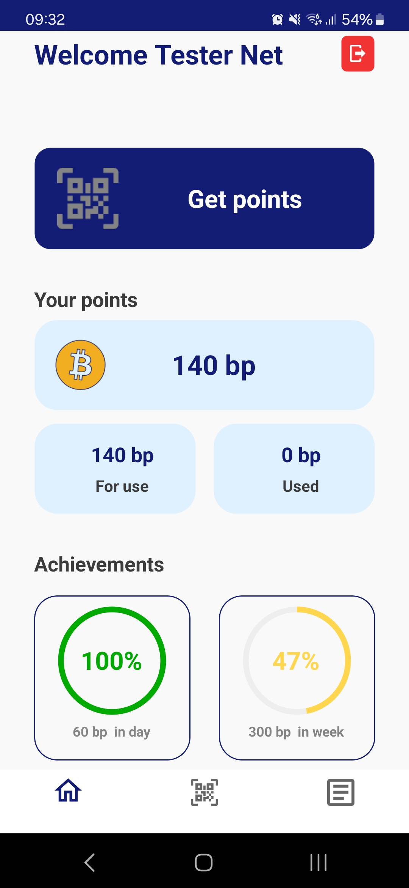

# BiPoints
 
Mobile application for obtaining points from scanned products. Earned points can be exchanged for prizes with home delivery.

# Table of Contens
* [General info](#general-info)
* [Technologies](#technologies)
* [Features](#features)

## General info

Log in to your account and then scan products. If the code you scanned is compatible with our items and has not been scanned before, we will top up your account with BiPoints.
Moblie app in Xamarin.Forms use MVVM architecture. 
API in .Net use 3-tier architecture.

## Technologies
Xamarin.Forms

ZXing

ProgressRing

MVVM

.Net

MySQL

EntityFramework

JwtBearer

3-tier architecture

## Features

When installing the application for the first time, we have the option of logging in or registering if we do not have an account.

After logging in, the main window appears with profile data.

After going to ScanPage and scanning the code, we receive information about the scanned product.

On the scan history page we can see all scanned products.

All pictures of the items and their names are for demonstration only
